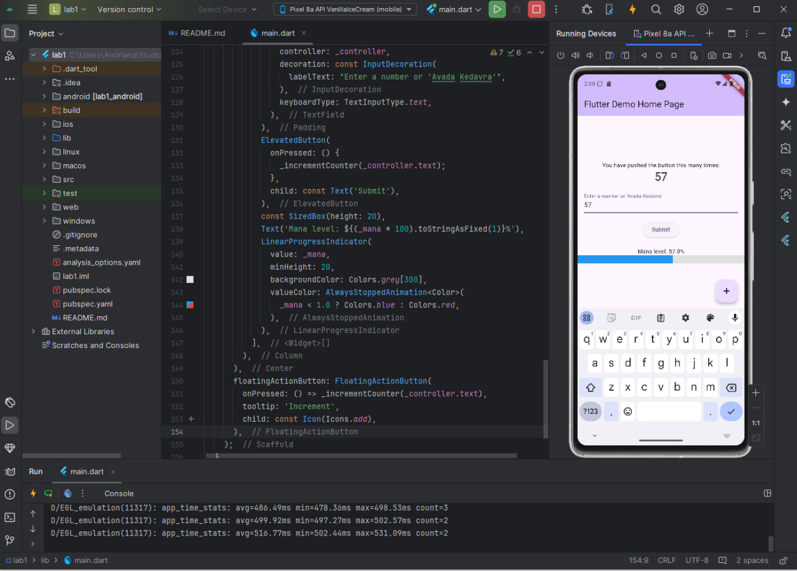

# Flutter Mana App

This Flutter application is a simple demonstration of stateful widgets, theme management, and input validation. The app features a counter and a mana bar that fills up based on user input. When the mana bar overflows, the app's theme changes. It also includes basic input validation and a "magic" input that resets the counter and mana.

## Features
- **Counter**: Incremental counter based on user input.
- **Mana Bar**: A visual representation of the "mana" that fills up based on the counter value.
- **Dynamic Theme Change**: When the mana bar overflows (i.e., reaches or exceeds 100%), the app theme changes to a new color.
- **Input Validation**: Ensures that user input is numeric and shows a warning if the input is invalid.
- **Special Command**: Entering "Avada Kedavra" resets both the counter and mana to zero.

## Screenshots
- Main screen with the counter, mana bar, and text input.
- Mana bar fills up and changes theme upon overflow.



## Prerequisites
- [Flutter SDK](https://flutter.dev/docs/get-started/install) installed on your machine.
- An IDE with Flutter support, such as [Android Studio](https://developer.android.com/studio) or [Visual Studio Code](https://code.visualstudio.com/).

## Getting Started
1. Clone the repository:
   ```bash
   git clone https://github.com/AndranaZayats/MobApsDev-andrianazaiats.git

## How It Works

## Counter and Mana
- Input: The user enters a number, which is added to the counter and used to increment the mana bar.
-Mana Overflow: When the mana value exceeds 1.0 (100%), the theme color changes, and the mana is reset, but any overflow is carried over to the next cycle.

## Theme Change
- Each time the mana bar overflows, the theme color changes cyclically through a predefined list of colors (_themeColors).

## Input Validation
- If the user enters non-numeric input, the app displays a Snackbar with a warning message: "Please enter a valid number."

## Special Command
- Entering the text Avada Kedavra in the input field will reset both the counter and mana to zero.

## Main Widgets and Methods
- MyApp: The main stateful widget that manages the theme of the application.
- MyHomePage: The primary page that holds the counter, mana bar, and input form.
- _incrementCounter: Increments the counter and mana based on user input. Also handles theme changes when mana overflows.
- _showInvalidInputWarning: Displays a Snackbar when invalid input is detected.

## Example Usage
1. Enter a number to increment the counter and mana.
2. If mana exceeds 100%, the app's theme color changes.
3. Enter "Avada Kedavra" to reset the counter and mana.

## Customization
- Theme Colors: You can modify the _themeColors list in the MyApp class to change the sequence of colors used when the theme changes.
- Mana Increment: Adjust the mana += number * 0.01 logic in _incrementCounter to modify how much mana is added per increment.
